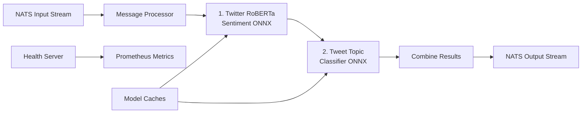

# NATS Stream Processor (Unified)

A high-performance Python microservice for processing Bluesky posts with **unified sentiment and topic classification** using ONNX Runtime for fast CPU inference. This service subscribes to NATS JetStream, performs **sentiment analysis first**, then **topic classification**, and publishes enriched data with both insights for real-time dashboards.

## 🚀 Features

- **Real-time Stream Processing**: Consumes posts from NATS JetStream with backpressure handling
- **Unified Processing Pipeline**: Performs sentiment analysis first, followed by topic classification on the same post
- **Fast CPU Inference**: 
  - Twitter RoBERTa ONNX model for sentiment (3-class: positive/negative/neutral)
  - Tweet-Topic-21 ONNX model for multi-label topic classification (19 topics)
- **Sequential Processing**: Sentiment inference → Topic inference → Combined output
- **Individual Message Processing**: Processes each post individually for low-latency analysis
- **High Confidence Filtering**: Only publishes results above configurable confidence thresholds
- **Production Ready**: Health checks, Prometheus metrics, structured logging, and Kubernetes deployment
- **Containerized**: Docker image with model caching and optimization
- **Observable**: Comprehensive metrics for processing rate, sentiment distribution, topic distribution, and performance

## 🚀 Quickstart

### Local Development (Docker)

```bash
# Start NATS and stream processor with docker compose watch for live reloading
# Uses .env.local for local development configuration
docker compose watch
```

### Local Development (Python)

```bash
# uv is the recommended way to install dependencies
curl -LsSf https://astral.sh/uv/install.sh | sh

# Install dependencies and run
uv sync --frozen
source .venv/bin/activate
python main.py
```

### Kubernetes Deployment

```bash
# Clone the repository
git clone https://github.com/richardr1126/nats-stream-processor.git
cd nats-stream-processor

# Configure environment variables
cp .env.example .env.prod
# Edit .env.prod with your NATS configuration
# Note: Production uses 'bluesky-posts' stream, local development uses 'bluesky-posts-dev'

# Deploy to Kubernetes
cd charts
./create-secrets.sh
helm install nats-stream-processor ./nats-stream-processor
```

## ⚙️ Configuration

Configure the service using environment variables:

### NATS Settings
- `NATS_URL`: NATS server URL (default: `nats://nats.nats.svc.cluster.local:4222`)
- `INPUT_STREAM`: Input JetStream stream name (default: `bluesky-posts`)
- `OUTPUT_STREAM`: Output JetStream stream name (default: `bluesky-posts-enriched`)
- `INPUT_SUBJECT`: Input subject pattern (default: `bluesky.posts`)
- `OUTPUT_SUBJECT`: Output subject prefix (default: `bluesky.enriched`)
- `CONSUMER_NAME`: JetStream consumer name (default: `unified-processor`)
- `QUEUE_GROUP`: Queue group name used for load-balanced consumption across replicas (default: same as `CONSUMER_NAME`)

### Processing / Consumer Settings
- `ACK_WAIT_SECONDS`: JetStream ack wait before redelivery (default: `30`)
- `MAX_DELIVER`: Max delivery attempts before JetStream stops redelivering (default: `3`)
- `MAX_ACK_PENDING`: Max unacked messages in-flight per consumer - lower this to prevent resource contention during catch-up (default: `100`)
- `MAX_RETRIES`: Maximum retry attempts for publish operations (default: `3`)
- `RETRY_DELAY`: Delay between retries in seconds (default: `1.0`)
- `DUPLICATE_WINDOW_SECONDS`: Output stream de-duplication window in seconds (default: `600` = 10 minutes)

### Sentiment Model Settings
- `SENTIMENT_MODEL_NAME`: HuggingFace model name (default: `onnx-community/twitter-roberta-base-sentiment-ONNX`)
- `SENTIMENT_MODEL_CACHE_DIR`: Local sentiment model cache directory (default: `/var/cache/models/sentiment`)
- `SENTIMENT_MAX_SEQUENCE_LENGTH`: Maximum text sequence length (default: `512`)
- `SENTIMENT_CONFIDENCE_THRESHOLD`: Minimum confidence to publish results (default: `0.4`)

### Topic Classification Model Settings
- `TOPIC_MODEL_NAME`: HuggingFace model name (default: `richardr1126/tweet-topic-21-multi-ONNX`)
- `TOPIC_MODEL_CACHE_DIR`: Local topic model cache directory (default: `/var/cache/models/topics`)
- `TOPIC_MAX_SEQUENCE_LENGTH`: Maximum text sequence length (default: `512`)
- `TOPIC_SIGMOID_THRESHOLD`: Sigmoid threshold for multi-label classification (default: `0.5`)

### Monitoring Settings
- `HEALTH_CHECK_PORT`: Health check server port (default: `8080`)
- `METRICS_ENABLED`: Enable Prometheus metrics (default: `true`)
- `LOG_LEVEL`: Logging level (default: `INFO`)
- `LOG_FORMAT`: Log format - `json` or `console` (default: `json`)

## 🏗 Architecture



### Processing Pipeline

1. **Message Consumption**: JetStream consumer with manual acknowledgment
2. **Text Preprocessing**: Tokenization and padding for both models
3. **Sentiment Analysis (First)**: Twitter RoBERTa ONNX inference (3-class: positive/negative/neutral)
4. **Confidence Filtering**: Skip if sentiment confidence is too low
5. **Topic Classification (Second)**: Multi-label topic classification (19 topics)
6. **Result Combination**: Merge sentiment and topic data
7. **Publishing**: Enriched posts with both sentiment and topics to output stream

### Message Format

**Input Message** (from nats-firehose-ingest):
```json
{
  "uri": "at://did:plc:abc123/app.bsky.feed.post/xyz789",
  "cid": "bafyrei...",
  "author": "user.bsky.social",
  "text": "Having a great day today!"
}
```

**Output Message** (enriched with sentiment and topics):
```json
{
  "uri": "at://did:plc:abc123/app.bsky.feed.post/xyz789",
  "cid": "bafyrei...",
  "author": "user.bsky.social",
  "text": "Having a great day today!",
  "sentiment": {
    "sentiment": "positive",
    "confidence": 0.94,
    "probabilities": {
      "negative": 0.02,
      "neutral": 0.04,
      "positive": 0.94
    }
  },
  "topics": {
    "topics": ["daily_life", "wellness"],
    "probabilities": {
      "arts_&_culture": 0.12,
      "business_&_entrepreneurs": 0.05,
      "daily_life": 0.78,
      "wellness": 0.62,
      ...
    },
    "top_topic": "daily_life",
    "top_confidence": 0.78
  },
  "processed_at": 1698765432.123,
  "processor": "nats-stream-processor"
}
```

## 📊 Monitoring

### Health Endpoints

- `GET /health` - Basic health check
- `GET /ready` - Kubernetes readiness probe (checks NATS connection)
- `GET /metrics` - Prometheus metrics

### Key Metrics

- `stream_processor_posts_processed_total` - Total posts processed
- `stream_processor_posts_published_total` - Posts successfully published with sentiment and topics
- `stream_processor_sentiment_predictions_total{sentiment}` - Predictions by sentiment type
- `stream_processor_sentiment_confidence` - Histogram of sentiment confidence scores
- `stream_processor_topic_predictions_total{topic}` - Predictions by topic
- `stream_processor_topic_confidence` - Histogram of topic confidence scores
- `stream_processor_processing_duration_seconds` - Individual post processing time (total)
- `stream_processor_model_inference_duration_seconds{model}` - Model inference time (sentiment/topic)
- `stream_processor_message_queue_size` - Current message queue size
- `stream_processor_nats_connected` - NATS connection status
- `stream_processor_errors_total{error_type}` - Total processing errors by type

### Example Metrics

```
# HELP stream_processor_sentiment_predictions_total Total sentiment predictions made
# TYPE stream_processor_sentiment_predictions_total counter
stream_processor_sentiment_predictions_total{sentiment="positive"} 1547
stream_processor_sentiment_predictions_total{sentiment="negative"} 423
stream_processor_sentiment_predictions_total{sentiment="neutral"} 782

# HELP stream_processor_processing_duration_seconds Time taken to process individual posts
# TYPE stream_processor_processing_duration_seconds histogram
stream_processor_processing_duration_seconds_bucket{le="0.01"} 45
stream_processor_processing_duration_seconds_bucket{le="0.05"} 123

# HELP stream_processor_nats_connected NATS connection status
# TYPE stream_processor_nats_connected gauge
stream_processor_nats_connected 1

# HELP stream_processor_errors_total Total processing errors
# TYPE stream_processor_errors_total counter
stream_processor_errors_total{error_type="model_init"} 0
stream_processor_errors_total{error_type="single_analysis"} 2
```

## 🔧 Development

### Project Structure

```
nats-stream-processor/
├── src/
│   ├── config.py           # Configuration management
│   ├── sentiment.py        # Twitter RoBERTa ONNX sentiment analyzer
│   ├── topic_classifier.py # Tweet-Topic-21 ONNX topic classifier
│   ├── nats_client.py      # JetStream consumer/producer
│   ├── service.py          # Main service orchestration (unified pipeline)
│   ├── health.py           # Health check endpoints
│   ├── metrics.py          # Prometheus metrics
│   ├── types.py            # Type definitions
│   └── logging_setup.py    # Structured logging
├── main.py                 # Entry point
├── Dockerfile              # Container build
├── docker-compose.yml      # Local development setup
├── pyproject.toml          # Dependencies
└── README.md              # This file
```

### Model Details

#### Sentiment Model: Twitter RoBERTa

- **Model**: `onnx-community/twitter-roberta-base-sentiment-ONNX` from HuggingFace
- **Training Data**: Fine-tuned on Twitter data, optimized for social media text
- **Runtime**: ONNX Runtime with CPU optimizations, uses quantized int8 model
- **Performance**: ~5-20ms inference per post
- **Memory**: ~256MB including model weights
- **Classes**: 3-class sentiment (positive/negative/neutral)
- **Label Mapping**: LABEL_0=negative, LABEL_1=neutral, LABEL_2=positive

#### Topic Model: Tweet-Topic-21

- **Model**: `richardr1126/tweet-topic-21-multi-ONNX` from HuggingFace
- **Training Data**: Fine-tuned on tweet data for multi-label classification
- **Runtime**: ONNX Runtime with CPU optimizations, quantized model
- **Performance**: ~10-30ms inference per post
- **Memory**: ~256MB including model weights
- **Topics**: 19 predefined topics (multi-label)
- **Threshold**: Sigmoid threshold of 0.5 for topic inclusion

### Testing the Pipeline

1. **Start the full stack**:
   ```bash
   # For local development with mock data
   docker-compose up -d
   
   # For live development with auto-reload
   docker-compose watch
   ```

2. **Monitor processing**:
   ```bash
   # View sentiment processor logs
   docker-compose logs -f nats-stream-processor
   
   # Check metrics
   curl http://localhost:8080/metrics
   ```

3. **Inspect streams**:
   ```bash
   # Access NATS box
   docker-compose run --rm nats-box
   
   # List streams
   nats stream list
   
   # View messages in input stream (development uses -dev suffix)
   nats stream view bluesky-posts-dev
   
   # View messages in output stream (development)
   nats stream view bluesky-posts-enriched-dev
   ```

### Performance Tuning

- **CPU Threads**: Adjust ONNX runtime threads in model files
- **Confidence Thresholds**: Adjust `SENTIMENT_CONFIDENCE_THRESHOLD` and `TOPIC_SIGMOID_THRESHOLD`
- **Memory**: Both models use ~512MB total, container ~1GB recommended
- **Ack Wait**: Increase `ACK_WAIT_SECONDS` if processing can exceed current ack wait during warm-up
- **Max Ack Pending**: Lower `MAX_ACK_PENDING` (e.g., 50-100) to prevent resource contention during catch-up

## 🎯 Performance Characteristics

- **Throughput**: 30-100 posts/second (sequential sentiment + topic processing)
- **Latency**: 15-50ms total processing time per post
  - Sentiment: 5-20ms
  - Topic: 10-30ms
- **Memory**: 1GB typical usage, 2GB limit recommended
- **CPU**: 500-1000m typical usage, 2000m limit recommended
- **Model Load Time**: ~10-20 seconds on first startup (both models)

## 🔍 Troubleshooting

### Common Issues

1. **Model Download Fails**:
   ```bash
   # Check internet connectivity and HuggingFace access
   docker-compose run --rm nats-stream-processor python -c "from transformers import AutoTokenizer; AutoTokenizer.from_pretrained('onnx-community/twitter-roberta-base-sentiment-ONNX')"
   ```

2. **No Input Messages**:
   ```bash
   # Check if input stream exists and has messages
   # For local development
   kubectl exec -it deployment/nats-box -- nats stream info bluesky-posts-dev
   # For production
   kubectl exec -it deployment/nats-box -n nats -- nats stream info bluesky-posts
   ```

3. **High Processing Time**:
   - Check CPU limits and both model performance
   - Monitor inference duration metrics for sentiment and topic models
   - Verify `ACK_WAIT_SECONDS` and `MAX_DELIVER` settings

4. **Low Results**:
   - Check `SENTIMENT_CONFIDENCE_THRESHOLD` and `TOPIC_SIGMOID_THRESHOLD` settings
   - Verify input text quality and length
   - Monitor confidence histogram metrics for both models

5. **Connection Issues**:
   - Verify NATS_URL configuration
   - Check network connectivity between services
   - Monitor `stream_processor_nats_connected` metric

### Debugging Commands

```bash
# View detailed logs
kubectl logs deployment/nats-stream-processor | jq 'select(.level=="debug")'

# Check consumer lag
kubectl exec -it deployment/nats-box -n nats -- nats consumer info bluesky-posts unified-processor

# For local development
docker-compose exec nats-box nats consumer info bluesky-posts-dev unified-processor-dev

# Monitor metrics
kubectl port-forward svc/nats-stream-processor 8080:8080 &
watch -n 1 'curl -s http://localhost:8080/metrics | grep stream_processor'

# Check stream status
kubectl exec -it deployment/nats-box -n nats -- nats stream info bluesky-posts

# Test model loading
docker-compose run --rm nats-stream-processor python -c "
import asyncio
from src.sentiment import sentiment_analyzer
from src.topic_classifier import topic_classifier
async def test():
    await sentiment_analyzer.initialize()
    await topic_classifier.initialize()
    text = 'This is a great day for technology news!'
    sentiment = await sentiment_analyzer.analyze_sentiment(text)
    topics = await topic_classifier.classify_topics(text)
    print('Sentiment:', sentiment)
    print('Topics:', topics)
asyncio.run(test())
"
```

## 🤝 Integration

This service integrates with:

- **Upstream**: `nats-firehose-ingest` (provides input posts)
- **Downstream**: Real-time dashboard, analytics services
- **Monitoring**: Prometheus, Grafana dashboards
- **Infrastructure**: GKE, NATS JetStream, Kubernetes

## 📈 Scaling

- **Horizontal (recommended)**: Run multiple replicas using the same durable consumer (`CONSUMER_NAME`) and a shared queue group (`QUEUE_GROUP`). The service will bind to the durable and use queue semantics so each message is delivered to only one replica.
- **Vertical**: Increase CPU/memory limits for higher throughput
- **Model**: Consider GPU deployment for very high throughput (requires CUDA ONNX provider)

### Multi-pod setup with JetStream durables and queue groups

This service is configured to safely scale horizontally without consumer name conflicts by using a single durable consumer and a shared queue group:

1. All pods use the same `CONSUMER_NAME` (durable) and the same `QUEUE_GROUP`.
2. On startup, each pod attempts to bind to the durable; if it doesn't exist yet, one pod will create it.
3. Messages are delivered once to the queue group, and N pods share the work.

To verify the consumer setup:

```bash
kubectl exec -it deployment/nats-box -n nats -- nats consumer info bluesky-posts unified-processor
```

## 🤝 Contributing

1. Fork the repository
2. Create a feature branch
3. Add tests for new functionality
4. Ensure all tests pass and metrics work
5. Submit a pull request

## 📄 License

This project is part of a class assignment for datacenter computing.
