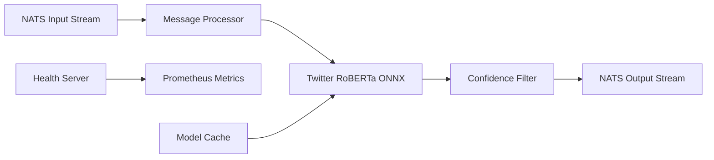

# NATS Stream Processor

A high-performance Python microservice for processing Bluesky posts with Twitter RoBERTa sentiment analysis using ONNX Runtime for fast CPU inference. This service subscribes to NATS JetStream, performs sentiment classification, and publishes enriched data for real-time dashboards.

## 🚀 Quickstart

### Local Development (Docker)

```bash
# Start NATS and stream processor with docker compose watch for live reloading
# Uses .env.local for local development configuration
docker compose watch
```

### Local Development (Python)

```bash
# uv is the recommended way to install dependencies
curl -LsSf https://astral.sh/uv/install.sh | sh

# Install dependencies and run
uv sync --frozen
source .venv/bin/activate
python main.py
```

### Kubernetes Deployment

```bash
# Clone the repository
git clone https://github.com/richardr1126/nats-stream-processor.git
cd nats-stream-processor

```bash
# Configure environment variables
cp charts/.env.example charts/.env
# Edit charts/.env with your NATS configuration
# Note: Production uses 'bluesky-posts' stream, local development uses 'bluesky-posts-dev'

# Deploy to Kubernetes
cd charts
./create-secrets.sh
helm install nats-stream-processor ./nats-stream-processor
```

## 🚀 Features

- **Real-time Stream Processing**: Consumes posts from NATS JetStream with backpressure handling
- **Fast CPU Sentiment Analysis**: Twitter RoBERTa ONNX model optimized for social media text with CPU optimizations
- **Individual Message Processing**: Processes each post individually for low-latency sentiment analysis
- **3-Class Sentiment**: Detects positive, negative, and neutral sentiment with confidence scores
- **Production Ready**: Health checks, Prometheus metrics, structured logging, and Kubernetes deployment
- **High Confidence Filtering**: Only publishes sentiment results above configurable confidence threshold
- **Containerized**: Docker image with model caching and optimization
- **Observable**: Comprehensive metrics for processing rate, sentiment distribution, and performance
- **Mock Data Support**: Built-in mock data generator for testing and development

## ⚙️ Configuration

Configure the service using environment variables:

### NATS Settings
- `NATS_URL`: NATS server URL (default: `nats://nats.nats.svc.cluster.local:4222`)
- `INPUT_STREAM`: Input JetStream stream name (default: `bluesky-posts`)
- `OUTPUT_STREAM`: Output JetStream stream name (default: `bluesky-posts-sentiment`)
- `INPUT_SUBJECT`: Input subject pattern (default: `bluesky.posts`)
- `OUTPUT_SUBJECT`: Output subject prefix (default: `bluesky.posts.sentiment`)
- `CONSUMER_NAME`: JetStream consumer name (default: `sentiment-processor`)
- `QUEUE_GROUP`: Queue group name used for load-balanced consumption across replicas (default: same as `CONSUMER_NAME`)

### Processing / Consumer Settings
- `ACK_WAIT_SECONDS`: JetStream ack wait before redelivery (default: `120`)
- `MAX_DELIVER`: Max delivery attempts before JetStream stops redelivering (default: `5`)
- `MAX_RETRIES`: Maximum retry attempts for publish operations (default: `3`)
- `RETRY_DELAY`: Delay between retries in seconds (default: `1.0`)

### Sentiment Model Settings
- `MODEL_NAME`: HuggingFace model name (default: `onnx-community/twitter-roberta-base-sentiment-ONNX`)
- `MODEL_CACHE_DIR`: Local model cache directory (default: `/var/cache/models`)
- `MAX_SEQUENCE_LENGTH`: Maximum text sequence length (default: `512`)
- `CONFIDENCE_THRESHOLD`: Minimum confidence to publish results (default: `0.4`)

### Monitoring Settings
- `HEALTH_CHECK_PORT`: Health check server port (default: `8080`)
- `METRICS_ENABLED`: Enable Prometheus metrics (default: `true`)
- `LOG_LEVEL`: Logging level (default: `INFO`)
- `LOG_FORMAT`: Log format - `json` or `console` (default: `json`)

## 🏗 Architecture



### Processing Pipeline

1. **Message Consumption**: JetStream consumer with manual acknowledgment
2. **Text Preprocessing**: Tokenization and padding for Twitter RoBERTa
3. **ONNX Inference**: Fast CPU-optimized sentiment classification (3-class: positive/negative/neutral)
4. **Confidence Filtering**: Only publish high-confidence predictions
5. **Result Publishing**: Enriched posts with sentiment data to output stream

### Message Format

**Input Message** (from nats-firehose-ingest):
```json
{
  "uri": "at://did:plc:abc123/app.bsky.feed.post/xyz789",
  "cid": "bafyrei...",
  "author": "user.bsky.social",
  "text": "Having a great day today!"
}
```

**Output Message** (enriched with sentiment):
```json
{
  "uri": "at://did:plc:abc123/app.bsky.feed.post/xyz789",
  "cid": "bafyrei...",
  "author": "user.bsky.social",
  "text": "Having a great day today!",
  "sentiment": {
    "sentiment": "positive",
    "confidence": 0.94,
    "probabilities": {
      "negative": 0.02,
      "neutral": 0.04,
      "positive": 0.94
    }
  },
  "processed_at": 1698765432.123,
  "processor": "nats-stream-processor"
}
```

## 📊 Monitoring

### Health Endpoints

- `GET /health` - Basic health check
- `GET /ready` - Kubernetes readiness probe (checks NATS connection)
- `GET /metrics` - Prometheus metrics

### Key Metrics

- `stream_processor_posts_processed_total` - Total posts processed
- `stream_processor_posts_published_total` - Posts successfully published with sentiment
- `stream_processor_sentiment_predictions_total{sentiment}` - Predictions by sentiment type
- `stream_processor_sentiment_confidence` - Histogram of confidence scores
- `stream_processor_processing_duration_seconds` - Individual post processing time
- `stream_processor_model_inference_duration_seconds` - Model inference time
- `stream_processor_message_queue_size` - Current message queue size
- `stream_processor_nats_connected` - NATS connection status
- `stream_processor_errors_total{error_type}` - Total processing errors by type

### Example Metrics

```
# HELP stream_processor_sentiment_predictions_total Total sentiment predictions made
# TYPE stream_processor_sentiment_predictions_total counter
stream_processor_sentiment_predictions_total{sentiment="positive"} 1547
stream_processor_sentiment_predictions_total{sentiment="negative"} 423
stream_processor_sentiment_predictions_total{sentiment="neutral"} 782

# HELP stream_processor_processing_duration_seconds Time taken to process individual posts
# TYPE stream_processor_processing_duration_seconds histogram
stream_processor_processing_duration_seconds_bucket{le="0.01"} 45
stream_processor_processing_duration_seconds_bucket{le="0.05"} 123

# HELP stream_processor_nats_connected NATS connection status
# TYPE stream_processor_nats_connected gauge
stream_processor_nats_connected 1

# HELP stream_processor_errors_total Total processing errors
# TYPE stream_processor_errors_total counter
stream_processor_errors_total{error_type="model_init"} 0
stream_processor_errors_total{error_type="single_analysis"} 2
```

## 🔧 Development

### Project Structure

```
nats-stream-processor/
├── src/
│   ├── config.py           # Configuration management
│   ├── sentiment.py        # DistilBERT ONNX sentiment analyzer
│   ├── nats_client.py      # JetStream consumer/producer
│   ├── service.py          # Main service orchestration
│   ├── health.py           # Health check endpoints
│   ├── metrics.py          # Prometheus metrics
│   └── logging_setup.py    # Structured logging
├── main.py                 # Entry point
├── Dockerfile              # Container build
├── docker-compose.yml      # Local development setup
├── pyproject.toml          # Dependencies
└── README.md              # This file
```

### Sentiment Model Details

The service uses **Twitter RoBERTa** fine-tuned for sentiment analysis:

- **Model**: `onnx-community/twitter-roberta-base-sentiment-ONNX` from HuggingFace
- **Training Data**: Fine-tuned on Twitter data, optimized for social media text
- **Runtime**: ONNX Runtime with CPU optimizations, uses quantized int8 model for better performance
- **Performance**: ~5-20ms inference per individual post
- **Memory**: ~512MB including model weights
- **Classes**: 3-class sentiment classification (positive/negative/neutral)
- **Label Mapping**: LABEL_0=negative, LABEL_1=neutral, LABEL_2=positive
- **Advantage**: Better performance on short social media posts compared to generic models

### Testing the Pipeline

1. **Start the full stack**:
   ```bash
   # For local development with mock data
   docker-compose up -d
   
   # For live development with auto-reload
   docker-compose watch
   ```

2. **Monitor processing**:
   ```bash
   # View sentiment processor logs
   docker-compose logs -f nats-stream-processor
   
   # Check metrics
   curl http://localhost:8080/metrics
   ```

3. **Inspect streams**:
   ```bash
   # Access NATS box
   docker-compose run --rm nats-box
   
   # List streams
   nats stream list
   
   # View messages in input stream (development uses -dev suffix)
   nats stream view bluesky-posts-dev
   
   # View messages in output stream (development)
   nats stream view bluesky-posts-sentiment-dev
   ```

### Performance Tuning

- **CPU Threads**: Adjust ONNX runtime threads in `sentiment.py`
- **Confidence Threshold**: Lower `CONFIDENCE_THRESHOLD` for more results
- **Memory**: Model uses ~300MB, total container ~512MB
- **Ack Wait**: Increase `ACK_WAIT_SECONDS` if processing can exceed current ack wait during warm-up

## 🚢 Deployment to GKE

The service can be deployed using Helm charts or by building custom Kubernetes manifests.

1. **Ensure prerequisites**:
   ```bash
   # Check NATS is running
   kubectl get pods -n nats
   
   # Verify input stream exists
   kubectl exec -it deployment/nats-box -n nats -- nats stream list
   ```

2. **Build and push container image**:
   ```bash
   # Build and tag image
   docker build -t gcr.io/your-project/nats-stream-processor:latest .
   
   # Push to registry
   docker push gcr.io/your-project/nats-stream-processor:latest
   ```

3. **Deploy the service** (create your own Kubernetes manifests or Helm chart):
   ```bash
   # Example deployment
   kubectl apply -f k8s-deployment.yaml
   ```

4. **Monitor deployment**:
   ```bash
   # Check pod status
   kubectl get pods -l app=nats-stream-processor
   
   # View logs
   kubectl logs -f deployment/nats-stream-processor
   
   # Check health
   kubectl port-forward svc/nats-stream-processor 8080:8080
   curl http://localhost:8080/health
   ```

## 🎯 Performance Characteristics

- **Throughput**: 50-200 posts/second (individual processing)
- **Latency**: 5-20ms processing time per post
- **Memory**: 512MB typical usage, 1GB limit recommended
- **CPU**: 200-500m typical usage, 1000m limit recommended
- **Model Load Time**: ~5-10 seconds on first startup

## 🔍 Troubleshooting

### Common Issues

1. **Model Download Fails**:
   ```bash
   # Check internet connectivity and HuggingFace access
   docker-compose run --rm nats-stream-processor python -c "from transformers import AutoTokenizer; AutoTokenizer.from_pretrained('onnx-community/twitter-roberta-base-sentiment-ONNX')"
   ```

2. **No Input Messages**:
   ```bash
   # Check if input stream exists and has messages
   # For local development
   kubectl exec -it deployment/nats-box -- nats stream info bluesky-posts-dev
   # For production
   kubectl exec -it deployment/nats-box -n nats -- nats stream info bluesky-posts
   ```

3. **High Processing Time**:
   - Check CPU limits and model performance
   - Monitor inference duration metrics
   - Verify `ACK_WAIT_SECONDS` and `MAX_DELIVER` settings

4. **Low Sentiment Results**:
   - Check `CONFIDENCE_THRESHOLD` setting
   - Verify input text quality and length
   - Monitor confidence histogram metrics

5. **Connection Issues**:
   - Verify NATS_URL configuration
   - Check network connectivity between services
   - Monitor `stream_processor_nats_connected` metric

### Debugging Commands

```bash
# View detailed logs
kubectl logs deployment/nats-stream-processor | jq 'select(.level=="debug")'

# Check consumer lag
kubectl exec -it deployment/nats-box -n nats -- nats consumer info bluesky-posts sentiment-processor

# For local development
docker-compose exec nats-box nats consumer info bluesky-posts-dev sentiment-processor-dev

# Monitor metrics
kubectl port-forward svc/nats-stream-processor 8080:8080 &
watch -n 1 'curl -s http://localhost:8080/metrics | grep stream_processor'

# Check stream status
kubectl exec -it deployment/nats-box -n nats -- nats stream info bluesky-posts

# Test model loading
docker-compose run --rm nats-stream-processor python -c "
import asyncio
from src.sentiment import sentiment_analyzer
async def test():
    await sentiment_analyzer.initialize()
    result = await sentiment_analyzer.analyze_sentiment('This is a test message')
    print(result)
asyncio.run(test())
"
```

## 🤝 Integration

This service integrates with:

- **Upstream**: `nats-firehose-ingest` (provides input posts)
- **Downstream**: Real-time dashboard, analytics services
- **Monitoring**: Prometheus, Grafana dashboards
- **Infrastructure**: GKE, NATS JetStream, Kubernetes

## 📈 Scaling

- **Horizontal (recommended)**: Run multiple replicas using the same durable consumer (`CONSUMER_NAME`) and a shared queue group (`QUEUE_GROUP`). The service will bind to the durable and use queue semantics so each message is delivered to only one replica.
- **Vertical**: Increase CPU/memory limits for higher throughput
- **Model**: Consider GPU deployment for very high throughput (requires CUDA ONNX provider)

### Multi-pod setup with JetStream durables and queue groups

This service is configured to safely scale horizontally without consumer name conflicts by using a single durable consumer and a shared queue group:

1. All pods use the same `CONSUMER_NAME` (durable) and the same `QUEUE_GROUP`.
2. On startup, each pod attempts to bind to the durable; if it doesn't exist yet, one pod will create it.
3. Messages are delivered once to the queue group, and N pods share the work.

To verify the consumer setup:

```bash
kubectl exec -it deployment/nats-box -n nats -- nats consumer info bluesky-posts sentiment-processor
```

## 🤝 Contributing

1. Fork the repository
2. Create a feature branch
3. Add tests for new functionality
4. Ensure all tests pass and metrics work
5. Submit a pull request

## 📄 License

This project is part of a class assignment for datacenter computing.
